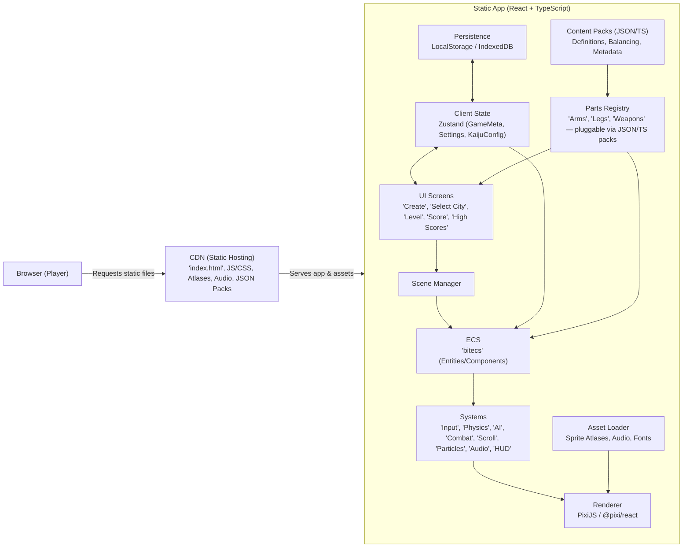
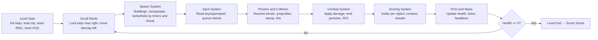
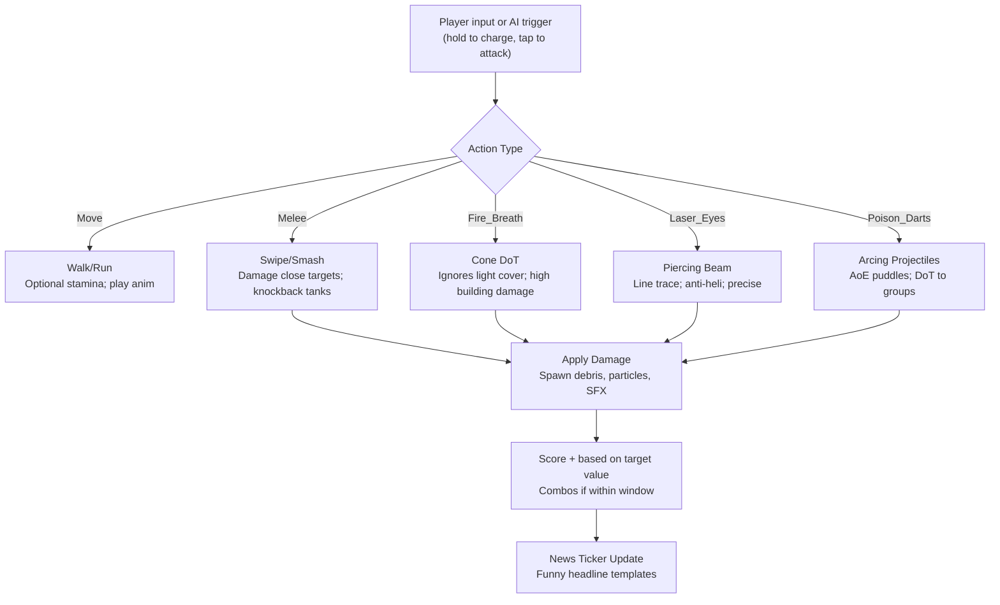
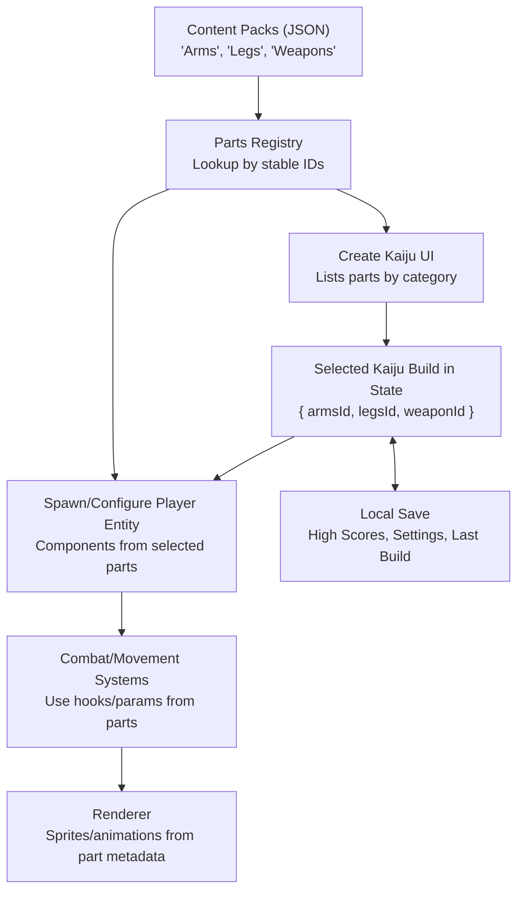

# Kaiju Sidescroller – Technical Design

## Overview

"Kaiju Sidescroller" is a single‑player right‑to‑left browser game where players create a custom kaiju (arms, legs, and one monster power: fire breath, laser eyes, or poison darts) and rampage through a city. Players earn points as a running "dollar damage" ticker while the military fights back with tanks and helicopters. The level ends when the kaiju’s health reaches zero, and players see their score and can submit it to a local leaderboard (on‑device).

---

## Gameplay Summary

* **Core Loop**: "Create Kaiju" → "Select City" → "Rampage" → "Score" → "High Scores" → "Restart".
* **Player Goal**: Maximize destruction dollars before health depletes.
* **Movement**: Auto‑scroll right→left; kaiju moves to screen center then world scrolls.
* **Combat**: Military spawns (tanks/helicopters) attack; kaiju attacks (melee + chosen weapon).
* **HUD**: Health bar above kaiju; top‑left "News Cast" ticker shows money destroyed and fun headlines.
* **Lose Condition**: Health ≤ 0.

---

## Technical Architecture (High Level)

* **Frontend (React + TS)**

  * **Renderer**: "PixiJS" or "@pixi/react" for performant 2D canvas rendering (alternatively, "Phaser" if preferred).
  * **State Management**: "Zustand" (lightweight) for UI/game meta; "bitecs" (ECS) for in‑tick entity logic.
  * **Game Loop**: RequestAnimationFrame; fixed‑timestep simulation with accumulator (e.g., 60 Hz) + interpolated rendering.
  * **Systems**: Input, Physics/Collision ("matter-js" or lightweight AABB), AI/Spawner, Combat, Damage/Scoring, Parallax/Scrolling, Particles, Audio ("howler.js"), UI/HUD.
  * **Assets**: Sprite sheets (TexturePacker), Spine/DragonBones optional for kaiju part animation.
  * **Persistence**: LocalStorage for last kaiju config and high scores; IndexeDB optional for larger blobs.

* **No Backend (Static Site)**

  * **Persistence:** LocalStorage / IndexedDB only.
  * **Features:** Local high scores, settings, last build; manual JSON import/export.
  * **Hosting:** CDN for app + assets (no API runtime).


* **Build/Tooling**

  * Vite (TS), ESLint, Prettier, Vitest/Jest, Playwright for E2E.
  * Asset pipeline script to pack sprites, generate type‑safe asset manifest.

---

## Mermaid – Architecture Diagram



---

## Scenes & Navigation

* **"Start"**: Buttons: "Start Game", "High Scores", "Options".
* **"Options"**: Toggle music/SFX and choose difficulty.
* **"Create Kaiju"**: Name field + choose Arms/Legs/Weapon (fire breath, laser eyes, poison darts). Preview updates live.
* **"Select City"**: Level list (difficulty/length/theme). Shows estimated payout multiplier.
* **"Level"**: Gameplay with parallax background, buildings, civilians/cars/tanks/helicopters, HUD.
* **"Score"**: Final dollar amount; buttons: "Play Again", "Submit Score", "High Scores".
* **"High Scores"**: Global list with name, kaiju, city, score, date.

### Mermaid – Scene Flow

```mermaid
stateDiagram-v2
  [*] --> "Start"
  "Start" --> "Create Kaiju": "'Start Game'"
  "Start" --> "High Scores": "'View High Scores'"
  "Start" --> "Options": "'Options'"
  "Options" --> "Start": "'Back'"
  "Create Kaiju" --> "Select City": "'Continue'"
  "Select City" --> "Level": "'Begin Rampage'"
  "Level" --> "Score": "'Health Zero'"
  "Score" --> "Start": "'Continue'"
  "High Scores" --> "Start": "'Back'"
```

---

## Gameplay Flow (In‑Level)



---

## Kaiju Actions – Flow



---

## Core Systems (Client)

* **"Scene Manager"**: Typed scene contracts (`enter`, `update(dt)`, `exit`), drives transitions.
* **"ECS (bitecs)"**: Entities are kaiju parts, enemies, bullets, buildings, effects.
* **"Input"**: Keyboard & gamepad; configurable mapping; intent queue consumed by systems.
* **"Physics/Collision"**: Tilemap collisions (solid buildings), AABB or matter‑js for dynamic bodies; simple gravity.
* **"AI/Spawner"**: Difficulty curves, timers, budget‑based spawns; helicopter altitude logic; tank line‑of‑sight.
* **"Combat"**: Damage types & resistances; crits; i‑frames; status (burning/poisoned).
* **"Scoring"**: Dollar values per asset; multiplier for streaks; headline generator.
* **"Parallax/Scrolling"**: Multi‑layer backgrounds (sky → mountains → skyline → mid‑ground → foreground debris).
* **"HUD"**: Health bar anchored over kaiju; top‑left news UI; pause overlay.
* **"Audio"**: SFX categories; duck music during headlines; spatial pan based on x.
* **"Particles/VFX"**: GPU‑friendly batches; pooling to reduce GC.

---

## Data Models (TypeScript)

```ts
// Shared types between client/server
export enum WeaponType { Fire = 'fire', Laser = 'laser', Poison = 'poison' }
export enum ArmType { Claws = 'claws', Club = 'club', Tentacles = 'tentacles' }
export enum LegType { Biped = 'biped', Quad = 'quad', Treads = 'treads' }
export enum Difficulty { Easy = 'easy', Normal = 'normal', Hard = 'hard' }

export interface KaijuConfig {
  name: string;
  arms: ArmType; // extendable
  legs: LegType; // style influences speed/knockback
  weapon: WeaponType;
}

export interface CityDefinition {
  id: string;
  name: string;
  difficulty: Difficulty;
  blocks: number; // rough length of level
}

export interface ScoreRecord {
  id: string;
  kaiju: KaijuConfig;
  cityId: string;
  score: number; // dollars
  createdAt: string; // ISO
}

export interface GameSettings {
  music: boolean;
  sfx: boolean;
  difficulty: Difficulty;
}
```

City data lives in `src/data/cities.ts`, where each `CityDefinition` specifies the level's
display name, difficulty, and rough length via a `blocks` count.

---


## Local Persistence (No Backend)

* **Storage:** High scores, settings, and last kaiju build stored client-side via **LocalStorage** (simple) or **IndexedDB** (for larger data).
* **Privacy:** Data never leaves the device. No accounts, no network writes.
* **Import/Export:** Provide JSON export/import so players can share scores or kaiju builds manually.
* **Data Model (examples):**
```ts
type ScoreRow = {
  id: string;          // uuid v4
  name: string;        // player display
  kaiju: { armsId: string; legsId: string; weaponId: string };
  cityId: string;      // reference to CityDefinition
  score: number;       // dollars destroyed
  createdAt: string;   // ISO 8601
};

type GameSettings = {
  music: boolean;
  sfx: boolean;
  difficulty: Difficulty;
};
```

## Level & Content Pipeline

* **Tilemap**: Tiled (.tmx/.json) or LDtk; export to packed JSON.
* **Sprites**: TexturePacker atlas → hashed filenames; manifest `.d.ts` generated for type safety.
* **Audio**: OGG/MP3 with fallback; short SFX preloaded.
* **Balancing**: CSV/JSON for spawn tables and values; loaded as data assets.

---

## Scoring & Headlines

* **Dollar Values**: Buildings (tiers), vehicles, military, civilian infrastructure.
* **Combos**: Destroy multiple items quickly → multiplier with decay.
* **Headlines**: Template strings with slots (e.g., `"{kaiju} causes ${amount} damage to {district}"`).

---

## Performance & Stability

* Fixed‑timestep simulation; decouple render; frame budget monitors.
* Object pooling for bullets, particles, debris.
* Texture atlases; avoid layout thrash; batch draw calls.
* Mobile considerations: dynamic resolution scaling; low‑VFX mode.

---

## Accessibility & UX

* Rebindable controls; color‑blind friendly VFX; text scaling.
* Reduced motion setting; screen shake toggle.
* Subtitles/captions for headlines and big events.

---

## Testing Strategy

* **Unit**: System functions (scoring, damage, spawner) with Vitest.
* **Integration**: Scene transitions; ECS system order.
* **E2E**: Playwright scripts for scene flow and score submission.
* **Perf**: CI budget checks (max entities, GC events).

---

## Future Extensions

* Multiple kaiju unlocks; meta progression.
* Daily city variants; seeded challenge modes.
* Photo mode; replay export.
* Cosmetic marketplace (skins) – client‑only cosmetics.

---

## Open Questions

* Use "Phaser" (batteries included) vs. "PixiJS + ECS" (more control)?
* Physics depth: simple AABB vs. full "matter-js"? (start simple, upgrade later)
* Anti‑cheat: client‑side heuristics (e.g., sanity checks, rate limits).


### Data & Content Flow (Pluggable Parts)


